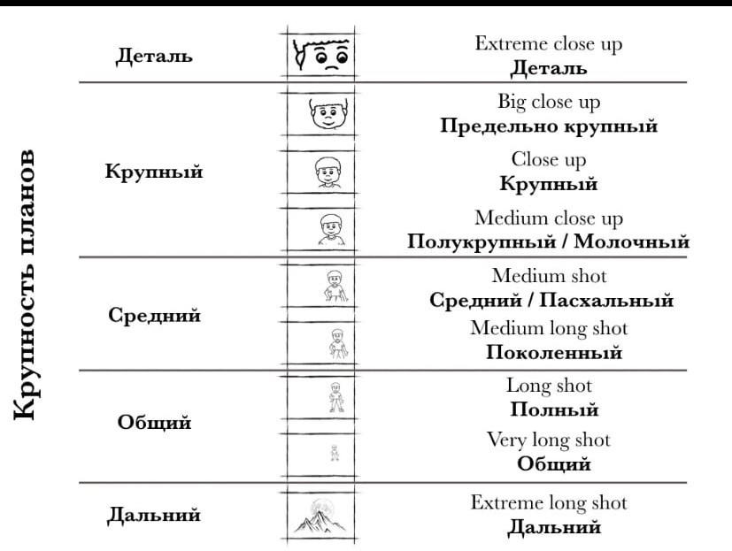

# Camera plan scale


## Getting started

- Python 3.6
- CUDA 10.0+
- Clone repository
```bash
git clone https://git.miem.hse.ru/gchkabisov2/camera-plan-scale.git
```
- Install requirements
```bash
pip install -r requirements.txt
```
## Usage

Camera plan
```bash
python yoloface_gpu.py --video stream --method area
```
## Principle of operation
Programm detects plans according to the picture below and outputs the plan in the right upper corner in green. 


Additionally, it detects transition plans, such as "Extreme<-bBig", "Close up<->medium" and "Medium<->long" and outputs them in yellow. 
The longest scale is "Extreme long shot" and programm detects it as zero faces on image.

## YOLOv3's architecture

Credit: https://towardsdatascience.com/yolo-v3-object-detection-53fb7d3bfe6b
Arxiv: https://arxiv.org/abs/1804.02767

## Model Weights
You need to download weights from https://drive.google.com/file/d/1LGOd-1TfBBYDiYCc0uWUMD5p2Tfsjc88/view?usp=sharing and place them into model-weights.

## References
The code was taken as a basis from https://github.com/sthanhng/yoloface - pretrained yolo for face detection.
